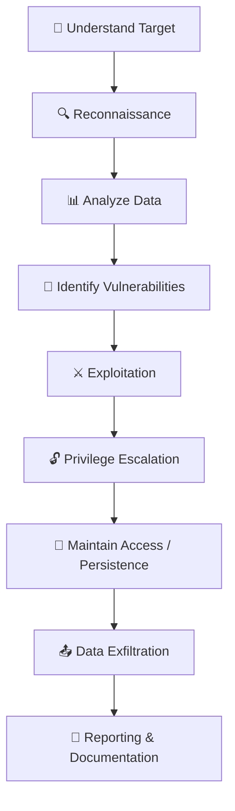

# 🚀 Pratik Harke | Cybersecurity Enthusiast

  

  
  
  

---

## 🏆 Achievements

- 🥇 Ranked **Top 1% Globally on TryHackMe**  
- 🧠 Completed multiple hands-on labs across Web, Network & Security domains  
- 🏁 Finalist at Kurukshetra 2025 Hackathon  

---

## 🔐 About Me

- Passionate about **breaking & securing systems**  
- Focused on **Web Exploitation, Network Security & Vulnerability Assessment**  
- Hands-on experience with **SIEM & security monitoring (Wazuh, Splunk)**  

💡 Passionate about solving real-world security problems through hands-on labs and CTF challenges.

---

## 🧠 Skills

- 🌐 Web Exploitation (SSRF, XXE, Injection)  
- 📡 Network Analysis (PCAP, DNS, ICMP)  
- 🔐 Cryptography  
- 🕵️ OSINT  
- 🧪 Vulnerability Assessment  
- 📊 SIEM Monitoring & Log Analysis  

---

## 🛠️ Tools & Tech

  

### 🔐 Security Tools  
Burp Suite • Nmap • Nessus • Wireshark • Metasploit • TheHarvester • Hashcat • Zenmap • Subjs  

### 📊 SIEM & Monitoring  
Wazuh • Splunk  

### 🧩 Core Domains  
Web Security • Network Security • Vulnerability Assessment • SIEM Monitoring  

---

## 📊 GitHub Stats

  
  

---

## 🔥 Featured Project

### 👉 [VishwaCTF 2026 Writeups](https://github.com/PratikHarke/VishwaCTF-2026-writeup)

- Real-world attack techniques  
- Structured methodology-based writeups  
- Covers Web, Crypto, Forensics & OSINT  

---

## 🧠 Offensive Security Workflow

---

## 🎯 Current Focus

- Advanced Web Exploitation  
- SIEM & Threat Detection  
- Cloud Security & Kubernetes Security  

---

## 📫 Connect With Me

- 💼 LinkedIn: https://www.linkedin.com/in/pratik-harke-b60782293  
- 💻 GitHub: https://github.com/PratikHarke  

---

  ⚡ "Think like an attacker. Defend like an engineer."

