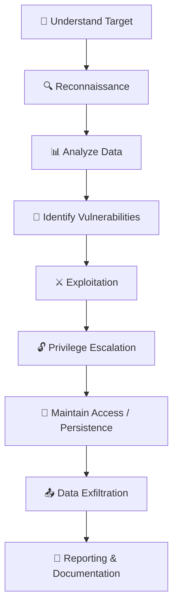

# 🚀 Pratik Harke | Offensive Security Researcher

  

  
  
  
  
  

---

## 🔐 About Me

Final-year Computer Engineering student (B.E., 2023–2027) at Jayawantrao Sawant College of Engineering, Pune, with a focused interest in offensive security, vulnerability research, and secure software development.

- 🕵️ Active bug bounty researcher on **HackerOne** and **Bugcrowd** (handle: `r4gn4r`)
- 🥇 Ranked **Top 1% globally on TryHackMe** — ~15,778 rank · 102-day streak · 227 rooms completed
- 🏁 3rd place team lead — Override.exe CTF, Scaler Ascent TechFest
- 🏆 Finalist — Kurukshetra 2025, 24-hour National-Level Hackathon
- 🧪 15+ hackathons across cybersecurity, AI, and software development
- 🎯 Seeking research/pentesting roles to apply hands-on offensive security skills professionally

---

## 🧠 Skills

**Offensive Security:** Penetration Testing, Web App Pentesting, Vulnerability Assessment, Bug Bounty Hunting, Reconnaissance, IDOR, Auth Bypass, Subdomain Takeover, OWASP Top 10, API Security

**Security Tools:** Burp Suite, Nmap, Nessus, Metasploit, Wireshark, Subfinder, Httpx, Nuclei, TheHarvester, Hashcat, Subjs, Kali Linux

**SIEM & Monitoring:** Wazuh, Splunk

**Languages:** Python, JavaScript, C++, Bash, Rust (basics)

**Web/Frontend:** React 18, Vite, HTML/CSS, REST APIs

---

## 🛠️ Tools & Tech

  

---

## 💼 Experience

**Bug Bounty Researcher** — HackerOne & Bugcrowd (Independent, Remote) · *Jan 2026 – Present*
- Active hunter across programs including Klarna, Nubank, OSL, Sophos, and Zomato/Eternal
- Findings span authentication bypass (CWE-306), subdomain takeover, and unauthenticated endpoint exposure
- 10+ formal vulnerability reports submitted across 6 programs

**Data Science Intern** — Yess Infotech, Pune · *Dec 2025 – Feb 2026*
- Data preprocessing and feature engineering for ML classification/regression models
- Built Python pipelines to optimize model performance and prediction accuracy

---

## 🔥 Featured Projects

### 🔑 [CryptoKit](https://cryptokit-nine.vercel.app) — v9.0.0
Privacy-first, browser-based CTF crypto workbench — React 18, Vite 6, WebAssembly, Vitest
- 30+ tools: beam-search auto-solver, hash identifier, JWT inspector, RSA attack toolkit, XOR analyzer with crib drag, LSB steganography — zero backend, zero data transmission
- 578 passing tests · independent security audit found & fixed 5 bugs
- Mozilla Observatory **A+ · 115/100** with hardened CSP, COEP/COOP isolation, SHA-pinned CI via GitHub Actions
- PR open on [awesome-ctf (#217)](https://github.com/) · Google Search Console verified · JSON-LD structured data · only 3 runtime dependencies

### 🕵️ PrivacyCheck
Chrome extension analyzing website privacy policies in real time using an on-device transformer NLP model — no data sent externally
- Generates contextual privacy risk ratings (data collection, third-party sharing, retention)
- Surfaces findings via in-browser overlay, no user interaction required

### 📊 [Wazuh Security Monitoring Lab](https://github.com/PratikHarke)
Self-hosted SIEM lab on Linux simulating and detecting real attack scenarios
- Brute-force logins, privilege escalation events, file integrity violations
- Custom Wazuh rules/decoders for log normalization; dashboards for real-time alert triage

### 📝 [VishwaCTF 2026 Writeups](https://github.com/PratikHarke/VishwaCTF-2026-writeup)
Structured, methodology-based writeups covering Web, Crypto, Forensics & OSINT challenges

### 🔐 [Cipher Encryption & Decryption](https://github.com/PratikHarke/Cipher_encyption_and_decryption)
Classic Caesar-cipher implementation exploring hashing algorithm fundamentals

---

## 📜 Certifications
- **TryHackMe** — Pre Security & Jr Penetration Tester Learning Paths · 2026
- **Cisco Networking Academy** — Endpoint Security · May 2025
- **Cisco Networking Academy** — Networking Basics · Feb 2025

---

## 🧠 Offensive Security Workflow

```mermaid
flowchart TD
    A[🎯 Understand Target] --> B[🔍 Reconnaissance]
    B --> C[📊 Analyze Data]
    C --> D[🧩 Identify Vulnerabilities]
    D --> E[⚔️ Exploitation]
    E --> F[🔓 Privilege Escalation]
    F --> G[📡 Maintain Access / Persistence]
    G --> H[📤 Data Exfiltration]
    H --> I[🧾 Reporting & Documentation]
```

---

## 🎯 Current Focus
- Advanced Web Exploitation & API Security
- SIEM & Threat Detection
- Cloud Security & Kubernetes Security

---

## 📊 GitHub Stats

  
  

---

## 📫 Connect With Me
- 💼 LinkedIn: [pratik-harke-b60782293](https://www.linkedin.com/in/pratik-harke-b60782293)
- 💻 GitHub: [@PratikHarke](https://github.com/PratikHarke)
- 📧 Email: insanepratik09@gmail.com

---

  ⚡ "Think like an attacker. Defend like an engineer."

